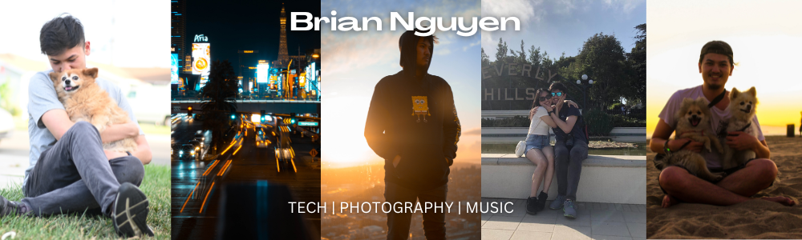

  

<h1 align="center">Hello there! I'm Brian Nguyen</h1>

## 🤓 About Me

### Experiences

I am currently serving as the Lead Code Instructor and Assistant Center Director
at Code Ninjas. In these roles, I am responsible for overseeing student success
and center management. My primary objective is to ensure that every student
receives a high-quality education to excel in their programming education.
Additionally, I provide mentorship, coaching, and support to both students and
fellow instructors. Lastly, I strive to create a positive and conducive learning
environment for all.

I have trained over 1,000 students in video game and web development utilizing
various programming languages such as HTML, CSS, JavaScript, Lua, and C# Unity

### Education

📚 I am a recent graduate from California State University, Long Beach with a
bachelor's degree in computer science. I also recently graduated from Bloomtech
with a certificate in full-stack development

### What I'm looking for

🖥️ I aspire to be a frontend developer or a full-stack developer! I love these
roles because they allow me to express my creativity in the applications that I
develop. If you work on an awesome team and are looking for your next teammate,
I'd love to hear from you

### Blogs

📔 I like to write blogs occasionally. Here are some that you might enjoy:

- [Optimizing Images for Your Website](https://brianenguyen.com/optimizing-images)
- [Volunteering with the Tzu Chi Foundation](https://brianenguyen.com/volunteering-with-tzu-chi)

### Interests / Additional Information

🌐 My website is [brianenguyen.com](https://brianenguyen.com) where I showcase my projects and information about me

🐧 I am a Linux enthusiast and I am an active and financial supporter of online freedom and privacy. This includes Wikipedia, the Free Software Movement, and the Electronic Frontier Foundation

🌇 When I am not programming, I enjoy video gaming, photography, volunteering, watching pro-wrestling, listening to music, walking on the beach while the sun is setting, and playing on the drums

## 💙 Connect With Me

  
  
  
  

